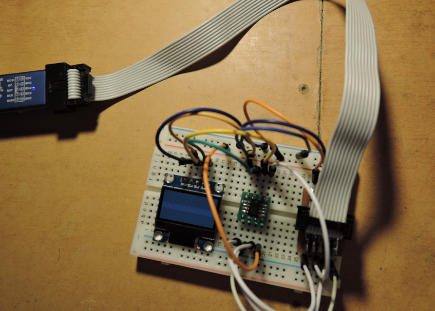

# ssd1306
 Простой пример кода работы с дисплеем ssd1306 
 для микроконтроллера attiny13 на gnu assembly.  
 
<code>
собрать исполняемый код
avr-gcc -no-pie -fno-stack-protector -fno-pic -Wall -mmcu=attiny13 -nostartfiles -nodefaultlibs  -o ssd1306.elf ssd1306.S
конвертировать бинарный код в шестнадцатиричный текстовый
avr-objcopy -O ihex ssd1306.elf ssd1306.hex
посмотреть размер кода
avr-size ssd1306.hex
   text	   data	    bss	    dec	    hex	filename
      0	    262	      0	    262	    106	ssd1306.hex
загрузить шестнадцатиричный формат в мк
avrdude -c usbasp -p attiny13 -B 10 -U flash:w:ssd1306.hex
</code>
